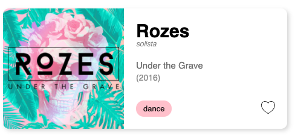

# 16-react-album-card

El reto consiste en realizar un componente de React el cual se parezca a este album:



El componente debe recibir las props necesarias para poder ser renderizado:

```JS
< Album image="" title="" artist="" />
```
